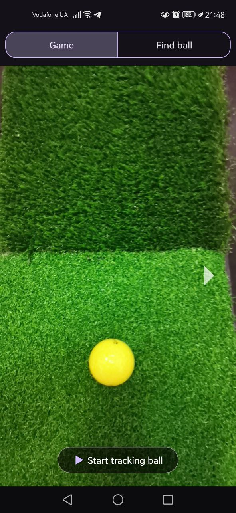
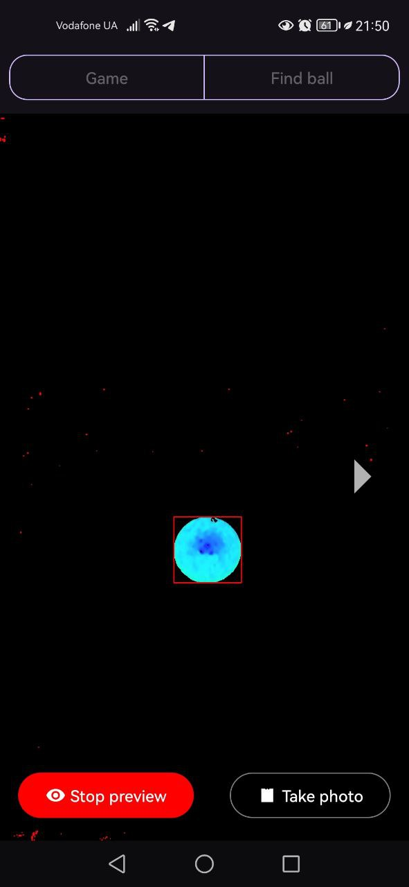

# 📱 GolfSim Mobile


## 📖 About the Project
**GolfSim Mobile** is an Android application that works together with the [PC version of GolfSim](https://github.com/l-Spook-l/golfsim-core).

Main features:
- Ball tracking and detection using **OpenCV**.
- Adjustable detection parameters via UI.
- Recording and sending shot videos to the PC over the local network for further analysis.
- Real-time operation for convenient use during practice and games.

💻 PC application: [GolfSim Core](https://github.com/l-Spook-l/golfsim-core)

⚠️ **Important:** The distance between the camera and the ball must be **50 cm** for correct tracking.

---

## 🚀 Features
- Detecting the ball by a selected color.
- Recording and sending shot videos.
- Camera live preview.
- Integration with the PC app for shot analysis and statistics storage.

---

## 🖼️ Screenshots
### Main Screen and Ball Detection:
<p align="center">
  
  
</p>

---

## 📦 Installation & Run
1. Clone the repository:
   ```bash
   git clone https://github.com/l-Spook-l/golfSim-mobile.git
   ```
2. Open the project in **Android Studio**.

3. Build the project to download all dependencies.

4. Run the app on a real Android device.  
   ⚠️ *Camera access is required.*

---

## Developers
- https://github.com/l-Spook-l

## Contact

If you have any questions or suggestions for improving the project, please contact serhii.mykhailovskyi.ua@gmail.com.
